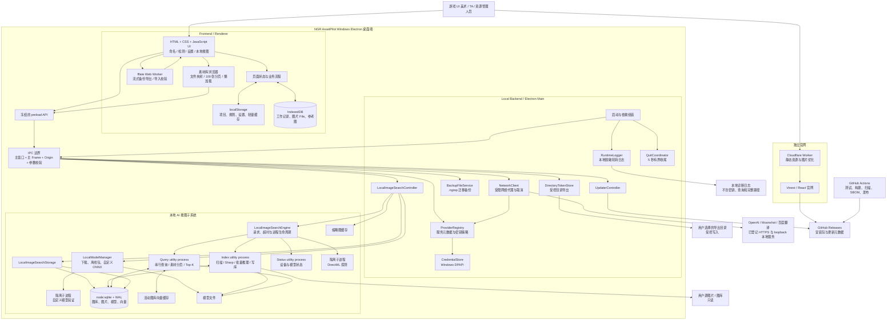
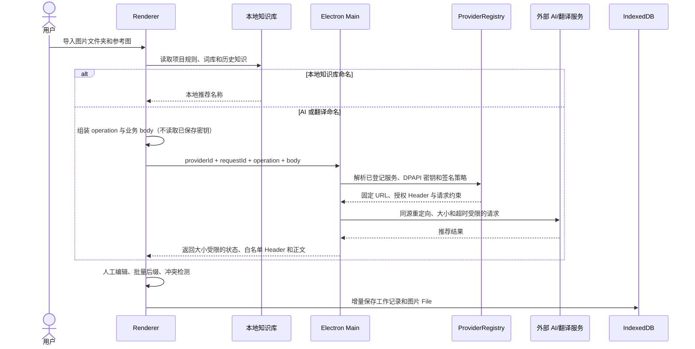
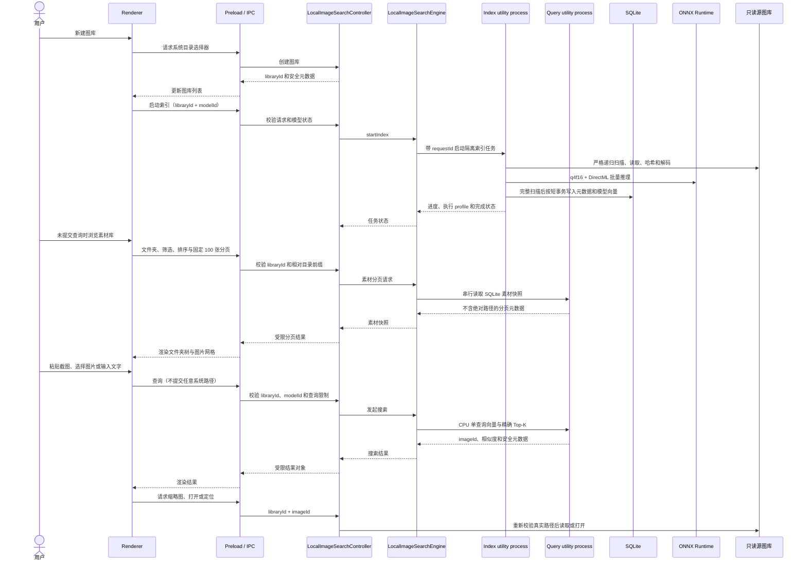

# NGR AssetPilot 系统架构

<!-- markdownlint-disable MD013 -->

本文档记录 NGR AssetPilot 当前的系统边界、核心模块、数据流和长期演进原则。它描述的是代码实际运行方式，不把尚未实现的云端账号、团队协作或服务端能力画进现有架构。

## 产品定位与架构原则

NGR AssetPilot 是面向游戏 UI 美术、技术美术和资源管理人员的 Windows 本地资源工作台，主要解决批量命名、命名规范管理、切图检测、进度保存、资源导出和本地相似图检索问题。

当前架构遵循以下原则：

- **本地单机优先**：核心工作流、项目配置、图片和本地 AI 索引均保存在用户电脑上。
- **桌面端为正式产品**：Electron 桌面应用是主要运行形态；浏览器直开仅作为历史兼容或开发辅助，不要求与桌面端保持完整功能对等。
- **源资源只读**：图库分析和相似图搜索不修改源图片；删除图库只删除应用数据目录中的索引和缩略图。
- **最小桌面权限**：Renderer 不直接获得 Node.js、任意系统路径或通用 Electron 能力，敏感操作必须经过 preload 和主进程校验。
- **离线能力优先**：模型就绪后，本地图库分析、图片搜索和文字搜索不依赖网络；模型支持离线包导入。
- **可信网络目标**：外部 AI 服务通过主进程代理访问；除内置 Provider 外，用户可显式登记精确的可信 HTTPS 服务，或登记精确 host、端口和 basePath 的本地 loopback 服务，Renderer 不能提交任意网络地址。
- **不提前云化**：当前没有第一方远程 Backend、在线账号、RBAC、云数据库或外部任务队列；在本地单机场景下，这是有意保持的简单边界。

## System Map

### 图中没有的组件

- **远程业务 Backend / API**：当前不存在。Electron 主进程承担本机 Backend 的角色。
- **在线 Authentication / Authorization**：当前不存在在线账号和 RBAC；本机凭据依赖 Windows 用户边界和 DPAPI。
- **外部 Cache / Queue**：当前不存在 Redis、消息中间件或云端任务队列；耗时任务使用本机 Worker、Electron utility process 和隔离探测子进程。
- **集中式 Monitoring**：当前没有云端遥测、崩溃收集或告警平台；应用只保留本地脱敏轮转日志和界面任务状态。
- **网站业务数据库**：官网代码保留了可选 D1/Drizzle 脚手架，但当前产品页面没有使用业务数据库。

## 核心模块与职责

| 模块 | 主要位置 | 职责 |
| --- | --- | --- |
| Renderer 应用 | `app/index.html`、`app/js/`、`app/styles.css` | 界面、命名工作流、检测规则、项目/方案、编辑、搜索 UI 和本地状态编排 |
| Electron 启动层 | `desktop/main/bootstrap.mjs` | 版本身份、数据目录、单实例、窗口、协议、服务实例和退出流程 |
| 安全与 IPC | `desktop/main/security.mjs`、`protocol.mjs`、`ipc.mjs`、`desktop/preload/` | 沙箱、CSP、导航限制、可信 IPC 和最小能力桥 |
| 通用桌面服务 | `desktop/services/` | Provider 注册、DPAPI 凭据、受限网络、目录 token、流式迁移备份、本地日志和应用更新 |
| 本地搜图控制层 | `desktop/services/local-image-search/controller.mjs` | 对外接口、请求校验、图库/模型/任务状态、缩略图和打开定位 |
| 本地搜图存储层 | `desktop/services/local-image-search/storage.mjs` | SQLite schema、图库、图片元数据、模型注册和向量状态 |
| 模型管理 | `desktop/services/local-image-search/model-manager.mjs` | 内置模型下载、哈希校验、离线包和自定义模型生命周期 |
| 推理与检索 | `engine.mjs`、`engine-worker.mjs` | 索引/查询/状态隔离进程、DirectML/CPU 调度、图像预处理、批量推理、素材分页、向量缓存和精确 Top-K |
| 官网 | `website/` | 产品介绍、经过校验的安装包下载入口；不承载桌面端业务数据 |
| 构建与发布 | `build/`、`scripts/`、`.github/workflows/` | 三版本打包、依赖检查、测试、凭据扫描、SBOM、哈希和 GitHub Release |

## 开源素材库复用决策

本地素材库没有闭门重造。在落地前后均对现成的本地优先素材管理器和可独立嵌入组件做了许可证、运行时与数据边界审查。结论是：复用成熟产品的交互与工程模式，但不在当前版本中嵌入另一套完整素材库运行时。

| 项目 / 组件 | 许可证与技术栈 | 可复用价值 | 当前决定 |
| --- | --- | --- | --- |
| [Meguri](https://github.com/zabuton-app/meguri) | MIT；Electron、React、TanStack Virtual、better-sqlite3、FFmpeg | 多工作区、增量扫描、缩略图、虚拟化媒体网格、固定 `workspaceId + fileId` 操作身份 | **交互和架构参考**。与 NGR 最接近，但整体嵌入会同时引入 React 渲染栈、第二套 SQLite、第二套扫描/缩略图管线和本地 HTTP 媒体服务；不复制其应用代码 |
| [Allusion](https://github.com/allusion-app/Allusion) | GPL-3.0；Electron | 面向美术素材库的成熟信息架构 | **只做产品参考**。GPL-3.0 前端代码不直接并入当前 MIT 应用 |
| [TagStudio](https://docs.tagstud.io/contributing/) | 核心逐步迁移 MIT；Qt 前端仍为 GPL-3.0 | 标签、查询和跨平台缩略图设计 | **按文件许可证单独评估**。不复制 Qt/GPL 前端 |
| [Mundam](https://github.com/marcusagm/Mundam) | MIT；Tauri、Rust、SolidJS | 高性能本地素材管理和专业格式思路 | **产品参考**。引入 Rust/Tauri 会形成第二套桌面运行时 |
| [@webreflection/file-tree](https://github.com/WebReflection/file-tree) | MIT；原生 Web Component | 异步文件夹树、键盘操作、零框架依赖 | **候选组件**。当前树已经满足受限 IPC、按需加载和无绝对路径 DTO；只有交互复杂度继续增长时再替换 |
| [egjs-grid / InfiniteGrid](https://github.com/naver/egjs-grid) | MIT；支持原生 JavaScript | Masonry、Justified、虚拟化和无限滚动 | **候选组件**。当前固定 100 张分页加 IntersectionObserver 已达到性能门，暂不为相同能力增加依赖 |
| [PhotoSwipe](https://photoswipe.com/) | MIT；原生 JavaScript | 图片全屏预览、缩放和键盘导航 | **下一阶段首选复用**。增加应用内原图预览时接入，并继续通过 `libraryId + imageId` 的受限主进程接口取图 |

当前素材库从这些项目中采用的成熟模式包括：多图库工作区、增量目录快照、分页或虚拟化边界、缩略图懒加载、旧响应失效、卡片操作绑定创建时的图库与图片身份、空态引导以及源文件只读。实现保留 NGR 已有的 `node:sqlite` 图片元数据、AI 向量索引和受限 IPC，避免用户为同一文件夹承担两次扫描、两份数据库和两套缩略图缓存。

本轮没有复制上述项目的源码，也没有仅为了“使用开源”而新增运行时依赖，因此不产生新的第三方代码声明。未来实际引入候选组件时，必须锁定版本、更新 SBOM 和 `THIRD-PARTY-NOTICES.md`，并补离线打包与 Electron E2E。

## 关键业务数据流

### 1. 图片命名

### 2. 文件导出

Renderer 只生成相对目录和最终文件名。用户在主进程目录选择器中选择目标目录后，主进程签发与当前窗口绑定的目录 token；后续图片按块写入，并在每次操作时重新校验安全相对路径。导出过程只改目标文件名，不重新编码图片内容。

### 3. 本地 AI 搜图

模型与索引关系为：

- `libraries` 保存图库定义。
- `images` 保存与模型无关的图片路径、mtime、大小、SHA-256 和尺寸。
- `models` 保存模型注册信息和指纹。
- `library_models` 保存每个图库在某个模型下的索引状态与执行配置。
- `image_embeddings` 按 `libraryId + imageId + modelId + fingerprint` 隔离向量。
- 新安装默认视觉塔是固定 revision 和 SHA-256 的 q4f16 模型；旧动态量化视觉塔以独立兼容模型保留，只允许 CPU batch 1 重建，避免继续产生不稳定的批量向量。
- 执行 profile 是覆盖模型、预处理、ONNX Runtime、provider、batch、设备、驱动与架构的 SHA-256；profile 变化会要求完整重建，禁止混合写入。
- 查询进程只保留当前活动图库、当前模型的连续向量和 imageId；超过 300 MiB 时改用 SQLite 分块精确 Top-K。

### 4. 应用更新

正式安装版通过 `electron-updater` 读取 GitHub Release 的 `latest.yml`。软件会在启动后延迟检查，并每 6 小时周期检查；发现更新后，由用户主动下载并确认安装。开发版、测试版和 portable 版不走正式自动更新渠道。

## 本地数据与存储边界

| 数据 | 存储位置 | 是否进入迁移备份 | 说明 |
| --- | --- | --- | --- |
| 项目、方案、规则、显示设置 | `localStorage` | 是 | 轻量 JSON 配置 |
| 命名记录、图片 File、参考图 | IndexedDB | 是 | 工作区恢复数据 |
| API 凭据 | `%APPDATA%` 下的 DPAPI 加密文件 | 新备份不导出；旧版加密包仍可导入 | Renderer 只能看到 Provider 元数据与 `hasSecret` |
| 图库、图片元数据和向量 | `%APPDATA%/.../local-image-search/index.sqlite3` | 当前独立管理 | SQLite WAL |
| ONNX 模型 | `%APPDATA%/.../local-image-search/models/` | 内置模型可使用 `.ngrmodel` 离线包 | 自定义模型通过本地 ONNX、外部权重和 tokenizer 向导导入 |
| 搜索缩略图 | `%APPDATA%/.../local-image-search/thumbnails/` | 否 | 可重建缓存 |
| 源图片 | 用户选择的原目录 | 否 | 应始终只读 |
| 本地诊断日志 | 应用 `userData` 目录 | 否 | 轮转保存版本、操作 ID、错误码、阶段和进程退出；禁止密钥、查询、正文与完整路径 |

## 安全边界

1. Renderer 视为低权限 UI，不直接拥有 Node.js 和文件系统能力。
2. preload 只暴露固定、递归冻结的接口，不暴露原始 `ipcRenderer`。
3. IPC 要求请求来自当前主窗口的主 Frame 和受信任的 `ngr-assetpilot://app` 来源。
4. 文件、图库和模型路径优先由主进程系统对话框产生，Renderer 使用 ID 或 capability token。
5. 已保存密钥只在主进程 ProviderRegistry 与 CredentialStore 中解密；网络请求以 `providerId + operation + body` 提交，并限制协议、精确 origin/basePath、方法、大小、同源重定向、超时和取消。
6. 自定义模型先在隔离子进程验证；运行阶段关闭远程模型访问，禁止脚本、自定义算子 DLL 和越界外部数据。
7. 索引、查询和状态进程彼此隔离；异常退出、无响应和超时会拒绝 pending 请求并按需重建。
8. 打包流程排除本地 API 配置和测试密钥，并生成 SBOM、哈希与构建清单；GitHub Actions 第三方步骤固定到完整 commit SHA。

## 当前架构优势

- Electron 主进程、preload、Renderer 的安全职责划分清楚。
- 本地 AI 已拆分 Controller、Storage、ModelManager、Engine 和 Worker，不是直接堆在 UI 中。
- 图片元数据与模型向量分离，可以支持多个模型和不同向量维度。
- 正式版、开发版、测试版拥有独立身份、数据目录和产物目录。
- 本地优先设计与产品用户处理未公开美术资源的隐私需求匹配。
- 源图库只读、搜索查询不保存，降低了误删与隐私风险。
- 精确依赖、自动化测试、安装包验证和 Release 元数据已经形成稳定发布主干。

## 已知约束与演进重点

以下内容是后续改进方向，不代表需要重写整个项目：

1. **Renderer 模块化**：当前仍依赖多个按顺序加载的全局脚本和共享可变状态。新增功能会同时触及 HTML、CSS、状态、事件、持久化和测试，应逐步迁移到明确的 ES Module 和功能边界。
2. **版本化数据迁移**：localStorage、IndexedDB、DPAPI、SQLite、模型文件和缩略图均有独立生命周期，需要统一的数据版本、迁移、容量和崩溃恢复策略。
3. **迁移包兼容与容量**：桌面导出使用 fflate 分块流式 ZIP；导入必须持续保留路径、条目、哈希、总大小和事务回滚门禁，并对旧 v1/加密包做回归测试。
4. **发布信任（明确未解决）**：当前 Windows 安装包和自动更新仍未做 Authenticode 签名，`verifyUpdateCodeSignature` 也因缺少发布证书而未启用。受保护 Release environment、最小权限和完整 SHA 固定只能降低 CI 风险，不能代替代码签名。
5. **诊断导出与崩溃恢复**：已有本地脱敏轮转日志和进程恢复，后续可增加由用户主动确认的诊断包；不得默认上传本地图片、查询或提示词。
6. **官网边界清理**：官网应自动同步正式 Release 信息，并移除或隔离当前未使用的 D1、Auth 和示例脚手架，减少版本和依赖漂移。

## 长期演进判断

在“本地单机优先、桌面端为主”的产品方向下，当前分层与产品目标基本匹配，不需要立即引入微服务或进行大规模重写。能否长期保持低维护成本，取决于上述模块化、迁移、任务调度、资源上限、签名和诊断问题是否持续得到治理。

建议保持 Electron 服务层和本地 AI 分层，通过小步演进解决 Renderer 模块边界、数据迁移、任务调度、资源上限、更新签名和诊断能力。只有在产品明确进入在线账号、多人协作或云同步阶段时，才需要新增独立远程 Backend、Authentication、RBAC、同步协议和服务端数据模型。
